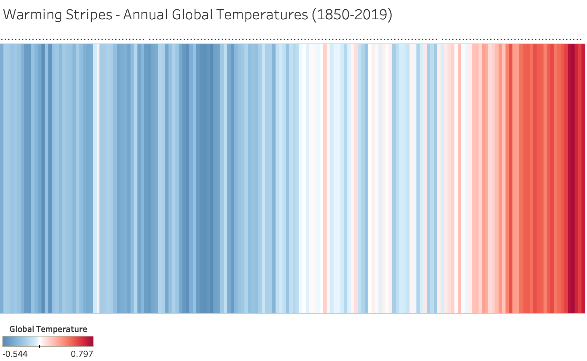

```{r setup, include=FALSE}
knitr::opts_chunk$set(echo = TRUE)
```

## Context

With our planet getting warmer every year, climate change is a burning topic amongst the environmentalists, scientists and governments.

Professor Ed Hawkins, a climate scientist in the National Centre for Atmospheric Science (NCAS) at the University of Reading highlighted this phenomenon with an intriguing visualization - 'Warming Stripes'. This visualisation highlights the increase in avaerage global temperatures over the last century gradually, with last five years being the warmest. The colour of each stripe represents the temperature of a single year, ordered from the earliest available data at each location to now.

(Ref-https://www.climate-lab-book.ac.uk/2018/warming-stripes/)

(Ref-https://www.ncas.ac.uk/en/18-news/2935-ed-hawkin-s-warming-stripes-add-colour-to-climate-communication)

## Visualizing warming stripes using Tableau

I have tried to recreate the warming stripes visualization using Tableau. By using 'Highlighted Tables' chart types, I have plotted the temperatures for each year from 1850 to 2019 using a colour gradient varying from -0.544 to 0.797.

```{r pressure, echo=FALSE, fig.cap="Warming_Stripes_Tableau", out.width = '100%'}



```

